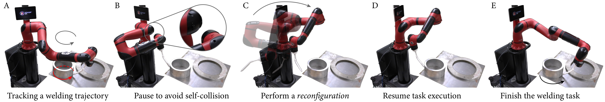
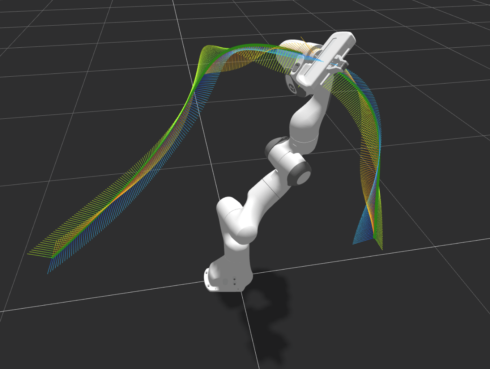

# IKLink

Implementation of our ICRA'24 paper: *IKLink: End-Effector Trajectory Tracking with Minimal Reconfigurations*


## Introduction
IKLink enables a robot manipulator to track reference end-effector trajectories of any complexity while performing minimal reconfigurations.  IKLink eliminates the need to manually segment a long or complex trajectory and is beneficial in real-life scenarios
that involve end-effector trajectory tracking, such as welding, sweeping, scanning, painting, and inspection. For more information, please refer to [our paper](). 



## Getting Started 

1. [Install Rust](https://www.rust-lang.org/learn/get-started)
2. Compile:
    ```bash
    cargo build
    ```
3. Run a demo:
    ```bash
    cargo run --bin traj_tracing
    ```
    The demo processes end-effector trajectories in `input_trajectories` and saves the generated motions in `output_motions`. 
    
    We note that this Rust implementation is about 10x fasters than the Python implementation described in the paper. 
4. Expected output:
    ```bash
    Constructing nodes for point 0 / 767
    Constructing nodes for point 1 / 767
    ...
    Constructing nodes for point 766 / 767
    Running dynamic programming algorithm
    Min Num of Reconfig: 3
    Saved motion to: <some_dir>/iklink/output_motions/panda_2023-08-25_11-37-55.csv
    ```
    

## Supplementary Video

[YouTube video link](https://youtu.be/EB4bJ6rJtnY)

## Citation

```
@inproceedings{wang2024iklink,
  title={ IKLink: End-Effector Trajectory Tracking with Minimal Reconfigurations},
  author={Wang, Yeping and Sifferman, Carter and Gleicher Michael},
  booktitle={2024 IEEE International Conference on Robotics and Automation (ICRA)},
  year={2024},
  organization={IEEE}
}
```

