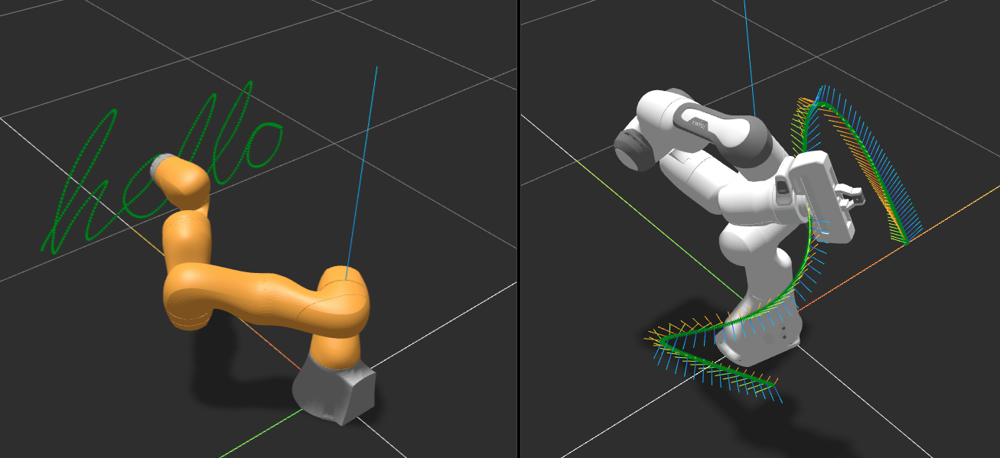

# Anytime IKLink

## Introduction
IKLink enables a robot manipulator to track reference end-effector trajectories of any complexity while performing minimal reconfigurations. This repository implements IKLink with an anytime framework, allowing it to quickly generate initial motions and continuously refine them over time.

## Getting Started 

1. [Install Rust](https://www.rust-lang.org/learn/get-started)
2. Compile:
    ```bash
    cargo build
    ```
3. Run a demo:
    ```bash
    cargo run --bin traj_tracing
    ```
    The demo processes end-effector trajectories in `input_trajectories` and saves the generated motions in `output_motions`. For example, `iiwa_hello0+iklink_anytime9+12057` is the robot motion after 9 iterations and the time usage is 12.057s. 
    
4. Expected output:
    ```bash
    # for the `iiwa_hello.csv` input trajectory
    Sampled 50 IK solutions for point 0 / 552
    Sampled 50 IK solutions for point 10 / 552
    ...
    Sampled 50 IK solutions for point 552 / 552
    Pre DP -- num_reconfig: 0, num_sparse_edge: 56, jnt_movement: 14.158923892575855
    DP -- num_reconfig: 0, num_sparse_edge: 0, jnt_movement: 14.817506209637592
    Saved motion to: <some dir>/IKLink/output_motions/iiwa_hello0+iklink_anytime0+1130.csv
    ...
    # for the `panda_random.csv` input trajectory
    Sampled 50 IK solutions for point 0 / 459
    Sampled 50 IK solutions for point 10 / 459
    ...
    Sampled 50 IK solutions for point 459 / 459
    Pre DP -- num_reconfig: 1, num_sparse_edge: 46, jnt_movement: 10.73735426281498
    ...
    DP -- num_reconfig: 2, num_sparse_edge: 0, jnt_movement: 10.982038551111707
    ...
    DP -- num_reconfig: 1, num_sparse_edge: 0, jnt_movement: 11.8840288009443
    ...

    ```

5. Visualization

    

    The output motions can be visualized using [Motion Comparator](https://pages.graphics.cs.wisc.edu/MotionComparator/). For example, to visualize `iiwa_hello0+iklink_anytimeX_XXXX.csv`,
    
    * Open a scene

        Click and drag "Scene 1" in the upper left cornor to open it
    * Add an iiwa robot
    
        In the panel on the right, under the "File" tab, locate the mesh section. Choose "iiwa" from the drop-down menu, then click the "confirm" button. An iiwa robot will be added to Scene 1.
    *  Upload the motion file

        In the panel on the right, under the "File" tab, locate the motion section. Click "Browse file", then choose your local file: `iiwa_hello0+iklink_anytimeX_XXXX.csv`. Upload the selected file.
    *  Play the motion
        
        Click the play button located in the lower left corner to play the motion.


